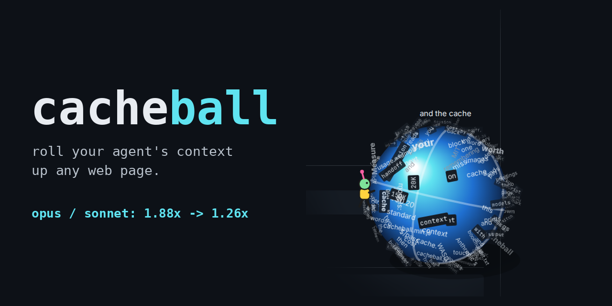
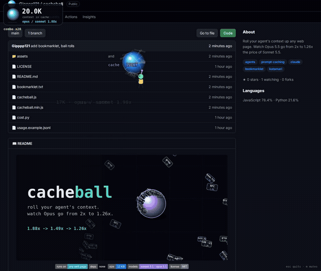

<p align="center">
  
</p>

<p align="center">
  <a href="https://gipppp121.github.io/cacheball/"></a>
  
  
  
  
  
</p>

# cacheball

**[Play it in your browser](https://gipppp121.github.io/cacheball/)**

Roll your agent's context up any web page. Every word you pick up grows the ball, and the ball is what the next turn re-reads from cache.

Cache reads cost $0.20 per 1M on both Sonnet 5.5 and Opus 5.5. So the bigger the ball gets, the smaller the gap between the two models:

| context in cache | Sonnet 5.5 / turn | Opus 5.5 / turn | Opus / Sonnet |
|---|---|---|---|
| 20K  | $0.033 | $0.062 | 1.88x |
| 150K | $0.059 | $0.088 | 1.49x |
| 400K | $0.109 | $0.138 | 1.26x |

The counter in the corner shows that ratio live while you roll.

## Run it

Fastest way: open the [play page](https://gipppp121.github.io/cacheball/) and press **roll this page**.

On any other page, this README included, and paste `cacheball.js` into the browser console. Or save `bookmarklet.txt` as a bookmark and click it on any page.

| input | what it does |
|---|---|
| mouse, touch | roll toward the pointer |
| arrows, WASD | roll |
| `Enter` | hand off early and see your result |
| `R` | roll again from the result card |
| `C` | copy your result |
| `M` | mute |
| `Esc` | quit and put every word back |

Small words first. Big headings and images stay put until the ball is big enough to take them. Stop for 5 seconds and the cache goes cold: the next pickup pays a cache miss.

## Missions and the ending

Eight missions run while you roll:

| # | mission |
|---|---|
| 1 | roll up 25 words |
| 2 | catch a lucky word: opus, sonnet, cache, turn, handoff |
| 3 | hit a x10 combo |
| 4 | grow the cache to the first size goal |
| 5 | swallow a heading or an image |
| 6 | keep the cache warm for 20 seconds |
| 7 | grow the cache to the second size goal |
| 8 | clear the page |

The two size goals scale with the page you play on, so a short README and a long docs page are both winnable.

Clear 97% of the page and the last words fly into the ball on their own. The ball collapses into a 20K `handoff.md`, and a result card shows words, time, context, cache misses, how far opus / sonnet dropped, and a rank:

| rank | what it takes |
|---|---|
| S | page cleared, all 8 missions, zero cache misses |
| A | page cleared, at least 7 missions |
| B | at least 5 missions |
| C | anything else |

Press `Enter` at any point to hand off early. `R` rolls again, `C` copies a one-line result you can paste anywhere.

Nothing leaves the page. The script only hides the words it picked up and shows them again on `Esc`.

## Measure your own logs

`cost.py` reads one JSON line per Messages API call and prints $/turn and $/pass per model.

```bash
python cost.py usage.example.jsonl
```

```json
{"task": "fix-auth", "model": "claude-sonnet-5-5", "passed": true, "usage": {"input_tokens": 40, "output_tokens": 1500, "cache_read_input_tokens": 150000, "cache_creation_input_tokens": 5500}}
```

Read it in this order: the $/turn ratio, the avg turns ratio, then $/pass.

## Rules worth remembering

```
switching models mid-session   -> new session + handoff, never the transcript
switch at 300K context         -> 300,000 x $5 / 1M = $1.50 just to re-cache
same switch with 20K handoff   -> $0.10
one cache miss at 150K         -> $0.38 Sonnet / $0.75 Opus
```

Prices are Anthropic's standard API rates as of October 3, 2026. The ratio in the game is arithmetic on an assumed turn shape (5,500 new tokens, 1,500 output), not a measured bill.

## Demo



## Files

```
cacheball.js           the ball, readable source
cacheball.min.js       same thing, minified
bookmarklet.txt        paste as a bookmark URL
cost.py                $/turn and $/pass from your usage logs
usage.example.jsonl    sample log
assets/                banner and demo
```

## License

MIT
